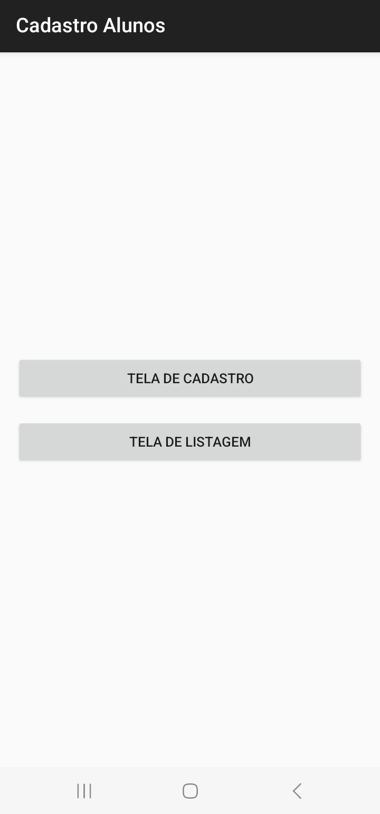

# AC2-Mobile-Atividade4 19/11/2024

### Fiz uma aplicação de cadastro de alunos usando mock API para Post e Get, Retrofit e API de CEP

### Link do vídeo explicativo no Youtube: https://youtu.be/WnKp8Pjerxg

